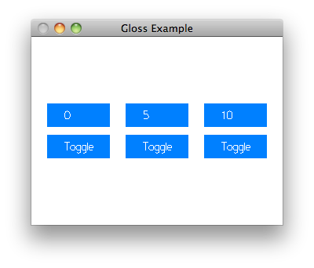

# FRP Zoo

Interested in trying FRP, but overwhelmed by the number of FRP libraries to choose from? To help you with this choice, this repository will contain several implementations of the same small program, using various implementations of FRP.

## The TodoMVC of FRP libraries

Following [Evan Czaplicki's excellent video summary of the different categories of FRP libraries](https://www.youtube.com/watch?v=Agu6jipKfYw), we would like to categorize FRP libraries according to the choices they make in their attempt to support dynamic graphs. He gave the following example:

1. Start with a graph which counts the number of clicks.
1. Click 5 times.
1. Change the graph so that it ignores the clicks.
1. Click 5 more times.
1. Change the graph back to the original graph.

Which number is displayed now? 10, because that's the total number of clicks? 5, because the clicks did not reach the click counter while it was outside the graph? 0, because each graph change resets the state?

Some FRP libraries might support more than one way to change graphs, while others might not support graph changes at all. Nevertheless, it should be possible to use the primitives of the library to implement all three scenarios; it will simply be easier to implement the scenario which displays 10 in an FRP library which chooses to continue to count the clicks in the background or which repeats the skipped clicks when the graph is switched back.

Thus, the toy program to be implemented in all FRP systems is as follows. A [gloss](gloss.ouroborus.net) window shall display six buttons, organized as three columns of two buttons. Each column implements one of the above scenarios: the first column chooses 0, the second column chooses 5, and the third column chooses 10. In each column, the bottom button changes the graph (if possible, faking it otherwise) so that the top button counts or ignores the clicks, starting with counting. When the clicks are being ignored, the column total displays -1.

## Keywords

Since FRP systems vary along many orthogonal dimentions, I simply plan to list all the libraries in alphabetical order, next to keywords indicating where the library lies in a number of dimensions. Here are the different dimensions I plan to consider.

First, in his video, Evan classifies FRP libraries into four categories:

1. First order FRP, in which event graphs cannot be changed for the duration of the program.
1. High-order FRP, in which event streams are infinite and the graphs can be changed in a way which typically matches the "10" scenario.
1. Asynchronous data flow, in which fast event-processing nodes may receive more recent events than their slower neighbours. Some versions of this model support "cold" signals, in which the event processing is skipped if nobody is listening for the results.
1. Arrowized FRP, in which graph nodes are automatons which may or may not tick each frame, depending on whether or not they are currently part of the graph. Best for the "5" scenario.

Another distinction is that some systems distinguish between Event streams (which only have values at discrete points in time) and Behaviours (which have values at all points in time), while other systems use a single type Signal to represent both, typically by using `Signal (Maybe a)` to represent events.

Finally, I have noticed that some systems have a builtin notion of time, from which derivatives and other time-based transformations can be computed, while other systems simply advance their state by one step when a new input event is given to the system.

Similarly, some systems might have builtin events like a `Behaviour MousePosition` provided by the library, while others depend on an event loop to feed them events from outside the graph. Since I was planning to use the event loop from gloss in all the implementations, I don't yet know how I would handle a system with builtin events.

## Libraries

For comparison, here is what the example app would look like if it was implemented without FRP.

* no FRP (pure functions): [example app](gloss-example/Main.hs)

And here is what the same app looks like when implemented with various FRP libraries:

* [Animas](https://hackage.haskell.org/package/Animas): untested
* [artery](https://hackage.haskell.org/package/artery): untested
* [bot](https://hackage.haskell.org/package/bot): untested
* [buster](https://hackage.haskell.org/package/buster): untested
* [definitive-reactive](https://hackage.haskell.org/package/definitive-reactive): untested
* [Dflow](https://hackage.haskell.org/package/Dflow): untested
* [drClickOn](https://hackage.haskell.org/package/drClickOn): untested
* [DysFRP](https://hackage.haskell.org/package/DysFRP): untested
* [elerea](https://hackage.haskell.org/package/elerea): untested
* [grapefruit](https://hackage.haskell.org/package/grapefruit-frp): untested
* [helm](https://hackage.haskell.org/package/helm): untested
* [io-reactive](https://hackage.haskell.org/package/io-reactive): untested
* [Moe](https://hackage.haskell.org/package/Moe): untested
* [netwire](https://hackage.haskell.org/package/netwire): untested
* [ordrea](https://hackage.haskell.org/package/ordrea): untested
* [peakachu](https://hackage.haskell.org/package/peakachu): untested
* [reaction-logic](https://hackage.haskell.org/package/reaction-logic): untested
* [reactive](https://hackage.haskell.org/package/reactive): untested
* [reactive-bacon](https://hackage.haskell.org/package/reactive-bacon): untested
* [reactive-banana](https://hackage.haskell.org/package/reactive-banana): [example app](reactive-banana-example/Main.hs), high-order FRP (scenario 0), Behaviour+Event.
* [reactive-haskell](https://hackage.haskell.org/package/reactive-haskell): untested
* [reactive-thread](https://hackage.haskell.org/package/reactive-thread): untested
* [reenact](https://hackage.haskell.org/package/reenact): untested
* [rsagl-frp](https://hackage.haskell.org/package/rsagl-frp): untested
* [RxHaskell](https://hackage.haskell.org/package/RxHaskell): untested
* [sodium](https://hackage.haskell.org/package/sodium): untested
* [spice](https://hackage.haskell.org/package/spice): untested
* [wxFruit](https://hackage.haskell.org/package/wxFruit): untested
* [Yampa](https://hackage.haskell.org/package/Yampa): untested
